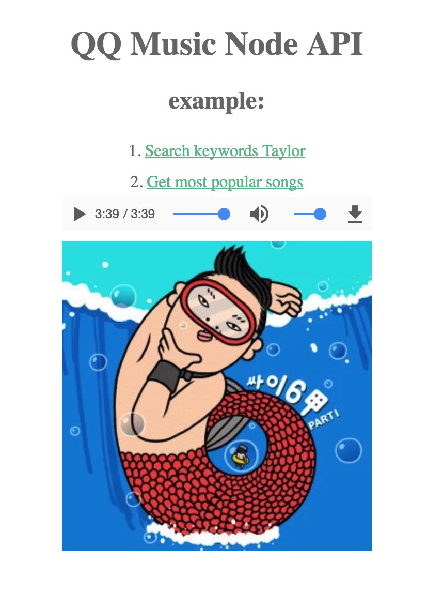

# QQMusicApi
QQ Music Nodejs API (QQ音乐 nodejs API)

运行
```
npm install
npm start
```



# TODO
1. 构建简单的React应用, 提供搜索框用来搜索歌曲并播放歌曲

# Reference
[https://github.com/ccchangkong/article/issues/23](https://github.com/ccchangkong/article/issues/23)

[https://github.com/Binaryify/NeteaseCloudMusicApi](https://github.com/Binaryify/NeteaseCloudMusicApi)
